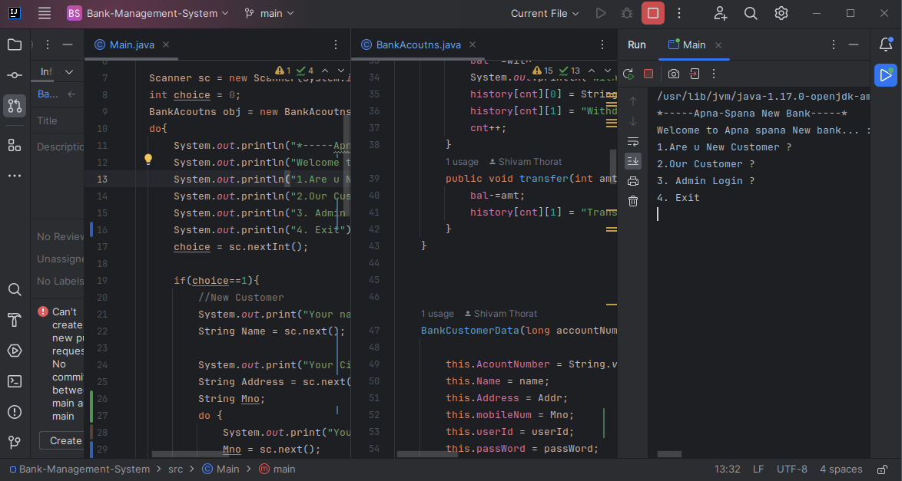

This Java code extends the previous Bank Management System by introducing a BankCustomerData class for storing customer 
information and a nested balance class to manage the account balance and transaction history. Additionally, the BankAcoutns 
class handles customer data, account balances, and includes methods for customer and admin operations.

Here's a brief overview of the added features:

<h3>1. BankCustomerData Class:</h3>

* Stores customer information such as account number, name, address, userId, and password. 
* Includes a nested balance class to manage account balance and transaction history. 
* The Display method prints account details. 
* The checkLogin method verifies login credentials. 

<h3>2. BankAcoutns Class:</h3>

* Uses a Vector to store customer data (custData) and account balances (balData). 
* Implements methods like acntNumValid to check the validity of the account number and getAcntNumIdex to get the index of the account number. 
* The insertnewData method adds new customer data and initializes a new balance object for the customer. 
* The checkLoginCustomer method checks login credentials for existing customers. 
* The LoginCustomer method provides a menu for customer operations such as checking balance, depositing, withdrawing, transferring money, and viewing transaction history. 
* The adminLogin method provides an administrative menu to view all customers or specific customer data. 

To introduce this code on GitHub, you can mention that it is an extension of the previously provided Bank Management System. 
Highlight the new features, such as the enhanced customer data structure, account balance management, and the addition of customer and admin functionalities. 
Consider providing examples of how to use the system in the README or code comments for users to understand its functionality better. Additionally, 
you may want to mention any plans for future improvements or features.  

